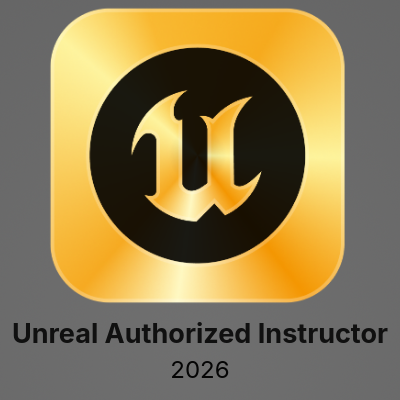

# Aaron Jablonski

**Creative Technologist | AI Engineer | Technical Artist**

Berlin-based Creative Technologist and AI Engineer working at the intersection of **AI systems, real-time 3D, and creative technology**. With an engineering background and full-stack development experience, I design and scale robust platforms for conversational agents, generative workflows, and creative technology applications.

My work focuses on **designing and deploying complex multi-modal, multi-agent AI systems** with robust backend orchestration, real-time communication layers, persistent memory, tool use, and production-ready cloud infrastructure. This systems-level AI engineering is grounded in a strong foundation across **Unreal Engine, Houdini, and web-based 3D**, allowing me to connect advanced agent architectures with real-time interactive experiences. Alongside production engineering, I also develop educational content and workshops around advanced Unreal Engine workflows.

---

### Technical Knowledge

- **Languages:** Python, TypeScript / JavaScript, C#, C++
- **AI & LLMOps:** Google ADK, LangChain, OpenAI, Gemini, Vertex AI, RAG architectures, multi-agent systems, TTS pipelines, custom generation workflows
- **Backend & Cloud:** FastAPI, NestJS, Node.js, Docker, Google Cloud Run, DigitalOcean, SQLite/PostgreSQL, WebSockets
- **Frontend & 3D Web:** Next.js, React, Three.js, WebGL
- **Real-Time Engines & Procedural DCC:** Unreal Engine, Unity, Houdini

---

### Featured Projects

#### 1. Virtual Humans Platform (2025 - 2026)

- **Stack:** Python (Google ADK), Unreal Engine, MetaHuman
- **Overview:** Ongoing development of a platform merging multi-modal agentic AI with high-fidelity 3D rendering. The work is being developed in the context of a research project with **Charité Berlin** and combines complex LLM tool usage, persistent user-specific agent memory, and custom animation blueprints.

#### 2. Stateful Persona-Driven AI Agent (2025)

- **Stack:** FastAPI, Next.js, Google ADK, Gemini, SQLite, Docker
- **Overview:** Production-ready full-stack agent featuring multi-agent delegation, token-authenticated APIs, and bidirectional WebSockets to drive a real-time 3D avatar with generative TTS and AI-driven lip-sync. Includes a secure GitHub OAuth admin dashboard for observability and cost management.

---

### Professional Experience

<b>AI Systems Engineer & Full-Stack Developer | Alias (2023 - 2025)</b>

 
Designed, deployed, and scaled the core infrastructure for a no-code, live-streaming 3D AI agent platform.  
* <b>AI Engineering & LLMOps:</b> Integrated OpenAI, Gemini, and Vertex AI, built evaluation workflows, and optimized performance across prompt, context, and model-version lifecycles. 
* <b>Backend & Real-Time Systems:</b> Developed scalable NestJS services for multi-agent session management, secure APIs, persistent memory, and high-concurrency WebSocket communication. 
* <b>Infrastructure & Tooling:</b> Managed CI/CD pipelines with Docker, GCP, and DigitalOcean, while building SDK and plugin-based extensions for agent behaviors, animations, and third-party integrations.

<b>Technical Artist (Unity) | Volkswagen Group Future Center (2024)</b>

 
* Developed a large-scale procedural environment for a driving simulator in Unity. 
* Engineered custom procedural pipeline tools for environment creation and interactive visual effects using VFX Graph and HDRP.

<b>ExitSimulation (2018 - Present)</b>

 
Creative technology outlet and educational platform focused on immersive experiences, real-time 3D applications, technical art tools, and advanced Unreal Engine education. 
* <b>Creative Technology:</b> Built installations, XR experiences, 3D visuals, and immersive projects using Unreal Engine and Houdini. 
* <b>Education:</b> Produced tutorials, workshops, and advanced learning content as an official Unreal Engine Instructor Partner. 
* <b>Industry Reach:</b> Work has been presented at venues such as MEET Milan and NXT Museum Amsterdam and distributed across Snapchat and Meta platforms at large scale.

<b>XR & Unity Developer | Orendt Studios & AVP Group (2015 - 2019)</b>

 
* Developed scalable C# application frameworks for interactive product experiences and digital twins. 
* Integrated ARKit/ARCore for fashion industry clients and authored dynamic 3D asset loading pipelines connected to external databases. 
* Explored and implemented browser-based real-time engines including PlayCanvas and A-Frame.

---

### Recognitions & Partnerships

- **Epic Games:** Unreal Engine Instructor Partner (2025 - now)
- **Meta:** Partner for XR Development (2019 - 2024)

---

### Education

**B.Eng. Audio-Visual Engineering** | Hochschule Duesseldorf (2019)

- **Focus:** Digital signal processing, computer engineering, mathematics, immersive technologies
